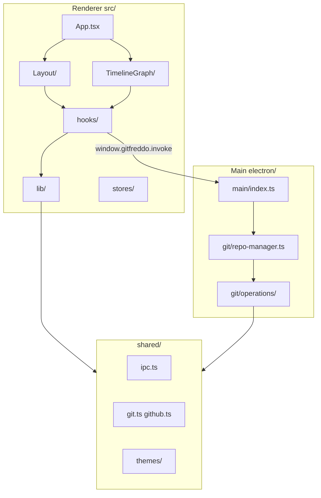

# Codebase map

Quick reference for navigating the GitFreddo repository. For IPC details see [architecture.md](architecture.md).

## Layer overview

## Renderer (`src/`)

| Area | Path | What lives here |
|------|------|-----------------|
| App shell | `src/App.tsx` | Root layout, modals, workspace routing |
| Sidebar | `src/components/Layout/` | `RepoSidebar`, `sidebar/*Section` |
| Commit graph | `src/components/TimelineGraph/` | Graph, ref badges, connectors |
| Diffs | `src/components/DiffViewer/` | Unified/split diff, conflict merge overlay |
| Detail panel | `src/components/DetailPanel/` | Commit/stash preview, reword/delete |
| Working tree | `src/components/WorkingTree/` | Stage/commit UI |
| Merge conflicts | `src/components/MergeConflicts/` | Full-screen conflict flow |
| GitHub UI | `src/components/GitHub/` | Thin providers over shared Forge UI (PR creation, repo picker) |
| GitLab UI | `src/components/GitLab/` | Thin providers over shared Forge UI (MR creation, repo picker) |
| Bitbucket UI | `src/components/Bitbucket/` | Thin providers over shared Forge UI (PR creation, repo picker) |
| Forge UI | `src/components/Forge/` | Shared CreateChangeRequestModal, RepoPicker, EditIssueModal |
| In-app help | `src/components/Help/` | Docs modal, markdown viewer |
| Settings | `src/components/Settings/` | Settings modal and panels |
| UI primitives | `src/components/Ui/` | Modal, Spinner, overlays |
| Git read hooks | `src/hooks/useGit.ts` | TanStack Query wrappers over IPC |
| Git write hooks | `src/hooks/useGitMutations.ts` | Mutations + cache invalidation |
| Selection state | `src/stores/selection.ts` | Diff overlay, selected commit/file |
| Workspace state | `src/stores/workspace.ts` | Tabs, paths, connection |
| Pure logic | `src/lib/` | Graph layout, diff parsing, context menus (grouped by domain) |
| i18n | `src/locales/` | UI string catalogs |
| Styles | `src/styles/` | Global CSS and theme tokens |

## Modals by feature

| Feature | Path |
|---------|------|
| Branches | `src/components/Branches/` — create, rename, merge, checkout, upstream, rebase |
| Remotes | `src/components/Remotes/` — add, edit URL |
| Tags | `src/components/Tags/` — create, rename, delete |
| History tools | `src/components/History/` — reflog, pickaxe, bisect, file history |
| Worktrees | `src/components/Worktrees/` — add worktree |
| Stash | `src/components/Stash/` — stash branch |
| Working tree | `src/components/WorkingTree/RenameFileModal.tsx` |
| Shell actions | `src/components/Layout/ActionBar.tsx`, `PushForceConfirm.tsx` |

## `src/lib/` subfolders

| Subfolder | Purpose |
|-----------|---------|
| `graph/` | Commit graph layout, edge paths, metrics |
| `timeline/` | Ref badges, column visibility, ref context menus |
| `diff/` | Unified diff parsing and display |
| `conflicts/` | Three-way merge, conflict markers, AI resolution |
| `context-menus/` | Commit, sidebar, detail-panel menu builders |
| `workspace/` | Session persistence, file trees, branch tree, paths |
| `git/` | Commit selection, reachability, stash, remote helpers |
| `format/` | Time formatting, tag name helpers |
| `docs/` | In-app docs catalog and content resolution |

Root-level: `types.ts`, `themes.ts`, `clipboard.ts`.

## Main process (`electron/`)

| Area | Path | What lives here |
|------|------|-----------------|
| Entry | `electron/main/index.ts` | Window, menu, IPC registration |
| Preload | `electron/preload/index.ts` | `window.gitfreddo` bridge |
| Dispatch | `electron/git/repo-manager.ts` | Routes `invoke` to repo operations |
| Git runner | `electron/git/git-runner.ts` | Spawns `git` subprocess |
| Operations | `electron/git/operations/` | One module per git domain |
| GitHub | `electron/github/` | OAuth, API client, token store |
| GitLab | `electron/gitlab/` | OAuth, API client, token store |
| Bitbucket | `electron/bitbucket/` | OAuth, API client, token store |
| Forge shared | `electron/forge/` | Token store factory, OAuth callback, HTTP helpers, connection status, SSH key helpers, repo cache/context |
| LLM | `electron/llm/` | AI fill and conflict assist |
| Settings | `electron/settings.ts` | App settings persistence |

### Git operations modules

| File | Domain |
|------|--------|
| `branch.ts` | Checkout, create, delete, rename, upstream |
| `log.ts`, `log-search.ts` | Commit graph and search |
| `diff.ts` | Working, staged, commit diffs |
| `status.ts` | Working tree status |
| `working.ts` | Discard, clean, rename files |
| `remote.ts` | Fetch, push, pull, remote management |
| `stash.ts` | Stash push/pop/apply/drop |
| `merge.ts` | Merge start/abort/continue |
| `rebase.ts` | Rebase, interactive rebase, squash |
| `tag.ts` | Tag create/delete/push |
| `worktree.ts` | Worktree add/remove/prune |
| `reflog.ts`, `bisect.ts`, `blame.ts` | Inspection tools |
| `maintenance.ts` | Prune, stale branches |
| `config.ts`, `notes.ts`, `repo.ts` | Config, notes, repo init |

## Shared (`shared/`)

| File | Purpose |
|------|---------|
| `ipc.ts` | IPC method types, app settings, menu actions |
| `git.ts` | URL parsing helpers |
| `github.ts` | GitHub API types (extends shared forge types) |
| `gitlab.ts` | GitLab API types (extends shared forge types) |
| `bitbucket.ts` | Bitbucket API types (extends shared forge types) |
| `forge.ts` | Cross-forge base types (change request, issue, merge method, slugify) |
| `forge-ssh.ts` / `forge-auth.ts` | Shared SSH title + auth-failure helpers |
| `gitLog.ts` | Log/graph shared types |
| `ai.ts` | AI fill and conflict proposal types |
| `themes/` | Theme definitions and colors |

Import from renderer via `@shared/...`.

## Naming

| Kind | Convention |
|------|------------|
| Component folders | PascalCase (`src/components/TimelineGraph/`) |
| React component files | PascalCase (`CommitPanel.tsx`) — matches established codebase practice |
| Non-component modules | camelCase (`fileTree.ts`, `formatTimeSince.ts`) |
| Main-process modules | kebab-case (`repo-manager.ts`, `git-runner.ts`) |
| Functions | camelCase |

## Tests

| Location | Contents |
|----------|----------|
| Co-located `*.test.ts(x)` | Next to the module under test |
| `src/test/` | Test setup, render helpers, mocks |
| `test/fixtures/` | Git repo fixtures for E2E |
| `e2e/` | Playwright smoke specs |
| `shared/*.test.ts`, `electron/**/*.test.ts` | Main-process and shared unit tests |

See also [refactor-plan.md](refactor-plan.md) for structural optimization phases.
