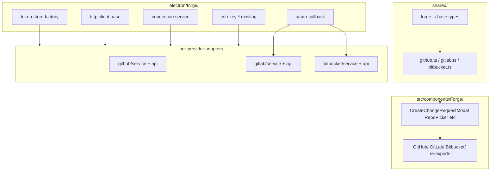

# GitFreddo structural optimization plan

Internal refactor plan to reduce duplication, improve reusability, and shrink the codebase **without changing user-visible behavior**. Coverage must stay above Vitest thresholds + 0.5pp buffer.

**Baseline captured:** 2026-07-14

## LOC baseline (production / tests)

| Area | Prod | Tests |
|------|------|-------|
| `electron/github/` | 1,612 | 2,641 |
| `electron/gitlab/` | 1,225 | 1,361 |
| `electron/bitbucket/` | 1,263 | 1,633 |
| `electron/forge/` | 72 | 185 |
| `src/components/GitHub/` | 634 | 756 |
| `src/components/GitLab/` | 654 | 776 |
| `src/components/Bitbucket/` | 654 | 787 |
| `src/components/Forge/` | 23 | 37 |
| `shared/{github,gitlab,bitbucket,forge-*}.ts` | 588 | — |
| `src/hooks/` | 2,630 | 4,043 |
| `src/lib/context-menus/` | 1,719 | 1,344 |
| `electron/git/operations/` | 3,681 | 3,895 |

**Coverage floors** (`vitest.config.ts`): global lines 95 / branches 80 / functions 70 / statements 85; `src/lib` 95/70/75/85; `shared` 95/65/85/80; `electron` 90/60/40/45.

---

## 1. Duplication map

### Forge backend (`electron/{github,gitlab,bitbucket}/`)

Duplication is concentrated in **infrastructure**, not API mappers:

| Pattern | Status | Est. prod savings |
|---------|--------|-------------------|
| Encrypted token stores (3 × ~43 lines) | Identical except path/name | ~100 |
| OAuth callback server (GitLab ≈ Bitbucket) | Near-identical `waitForAuthorizationCode` | ~130 |
| `service.ts` connection lifecycle | Same getStatus → token → user → SSH → auth-failure | ~120–150 |
| `repo-context.ts` resolve-remote loop | Same structure, different parsers | ~70 |
| `api/http.ts` fetch/json wrappers | Shared pattern; auth plugins differ | ~50–70 |
| Repo list TTL cache | Triplicated | ~30 |
| SSH key upload/list | Partially unified via `electron/forge/` | ~25–35 |

**Already unified:** `electron/forge/{ssh-key-pair,ssh-key-upload,resolve-ssh-key-title}`, `shared/forge-ssh.ts`, `shared/forge-auth.ts`, `electron/forge-oauth-env.ts`.

**Keep provider-specific:** GitHub device OAuth + PR review threads/GraphQL; Bitbucket app-password auth + SSH upload gating; GitLab self-hosted host threading; all API response mappers.

### Shared types (`shared/{github,gitlab,bitbucket}.ts`)

- `ForgeChangeRequest` / PR-MR shapes ~95% identical (GitHub adds `repository`).
- `ForgeIssue`, create-params, list-repos params, merge method — identical.
- `slugifyIssueBranch` — byte-for-byte three copies.
- Est. savings: **~120–150 LOC** after adding `shared/forge.ts`.

### Forge UI (`src/components/{GitHub,GitLab,Bitbucket}/`)

| Component | Overlap | Est. savings |
|-----------|---------|--------------|
| `CreatePrModal` (+ MergePrButton) | ~98% | ~400 |
| `RepoPicker` | ~97% | ~220 |
| `EditIssueModal` | ~95% | ~88 |
| `Fork*RepoModal` | ~90% | ~110 |
| `Create*RepoModal` | ~75% | ~157 |
| Settings integration cards | ~70% | ~294 |

Groundwork exists (`ForgeCreatePrModal` router, `src/lib/forge/detect.ts`) but does not consolidate implementation.

### Non-forge patterns

| Area | Finding | Est. savings |
|------|---------|--------------|
| `electron/git/operations/` | Hand-rolled exit-code throws; underused `runCommandOrThrow` | 150–250 |
| Sidebar rename modals | 3 near-identical rename modals | 70–90 |
| Modal footer / form reset | Repeated across ~15 modals | 50–80 |
| `src/hooks/useGit.ts` | 22 × same query scaffold | 50–70 |
| `src/lib/context-menus/` | `separator`, in-progress groups, i18n fallbacks | 80–120 |

### Dead / layer issues

- Test-only: `FixedHeightVirtualList`, `DynamicVirtualList`, `useFixedVirtualizer`, `useDynamicVirtualizer`.
- Unused: `src/lib/git/bitbucket.ts` barrel, `WorkingTreeFileRow.Chevron`.
- Layer violations: `buildCommitMessage`/`parseCommitMessage` in 5+ components; `buildConnectorSpecs` in TimelineRefConnectors; duplicated date/line formatters.

---

## 2. Prioritized phases

| Phase | Focus | Risk | Verify |
|-------|-------|------|--------|
| 0 | Baseline + this report | None | Report only |
| 1 | Dead code removal | Low | typecheck, test:changed, coverage |
| 2 | `shared/forge.ts` types | Low | test:unit, typecheck |
| 3 | Forge backend infra (token, OAuth callback, http, repo-context, cache) | Medium | test:unit, typecheck |
| 4 | Forge connection-service template | Medium | test:unit, typecheck |
| 5 | Git ops helpers + `useRepoQuery` | Medium | test:unit, test:renderer, typecheck |
| 6 | Layer extractions (commit message, connectors, formatters) | Low–Med | test:unit, test:renderer |
| 7 | Context-menu builders + modal primitives | Medium | test:renderer, typecheck |
| 8 | Forge renderer UI unification | High | test:renderer, test:e2e |
| 9 | Unused i18n detection + cleanup | Low | check-i18n, test:unit |
| 10 | Docs, CHANGELOG, full CI gate | Low | full gate |

---

## 3. Rejected / not worth the churn

- **Unifying provider API response mappers** — field names diverge too much; mappers stay provider-local.
- **Renaming ~297 `.tsx` files to kebab-case** — import-heavy, high risk, no runtime value. Update docs/rules to match PascalCase `.tsx` reality instead.
- **Merging GitHub device flow with browser OAuth** — fundamentally different UX and protocols.
- **Forcing GitHub PR review-thread / GraphQL types into shared forge** — no GitLab/Bitbucket equivalent.
- **Speculative abstractions** without ≥2 real call sites.

---

## 4. Target architecture (forge)

---

## 5. Constraints

- No user-visible behavior change.
- No IPC method renames, settings schema changes, or persisted-format migrations unless explicitly called out with a migration.
- Strict TDD: characterization tests before extraction; co-located `*.test.ts` for new modules.
- Prefer deleting over generalizing; ≥2 call sites required for new shared helpers.
- After each phase: `npm run test:changed` and `npm run typecheck` green before continuing.
- Final gate: typecheck, test:coverage, build, smoke, test:e2e, check-i18n.

---

## Status (2026-07-14)

Phases 0–10 completed. Final gate green:

- Coverage: **95.54%** lines / **85.91%** branches (global); per-glob floors held with buffer
- Notable net reductions: provider UI folders ~**1,000 → 940** prod after shared Forge shell (~470); provider backend ~**4,100 → 3,586** with `electron/forge` growing to ~452 of shared infra
- Deferred within Phase 8 (higher divergence, lower urgency): Fork/Create-repo modal shells and Settings integration-card unification — tracked as follow-ups in rejected-churn spirit when call sites justify
